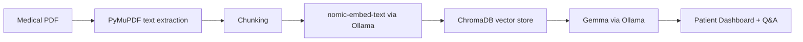
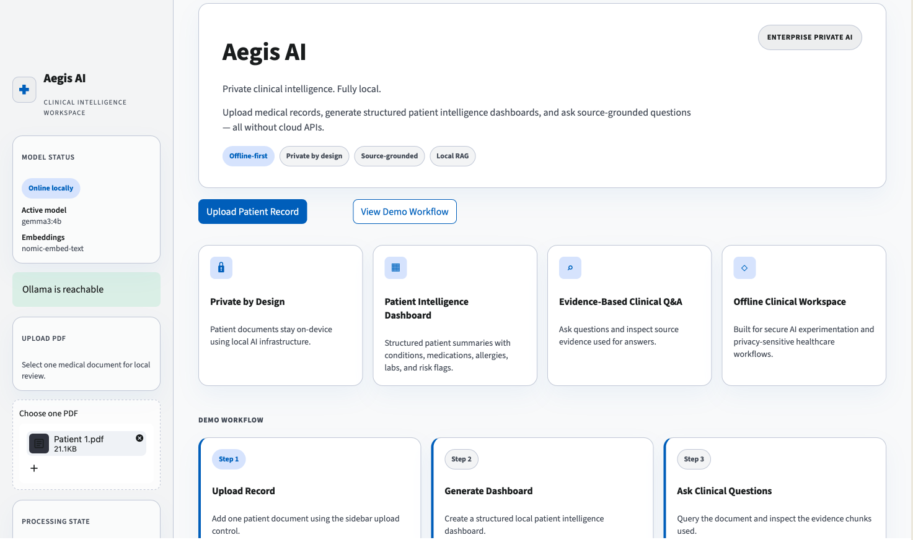
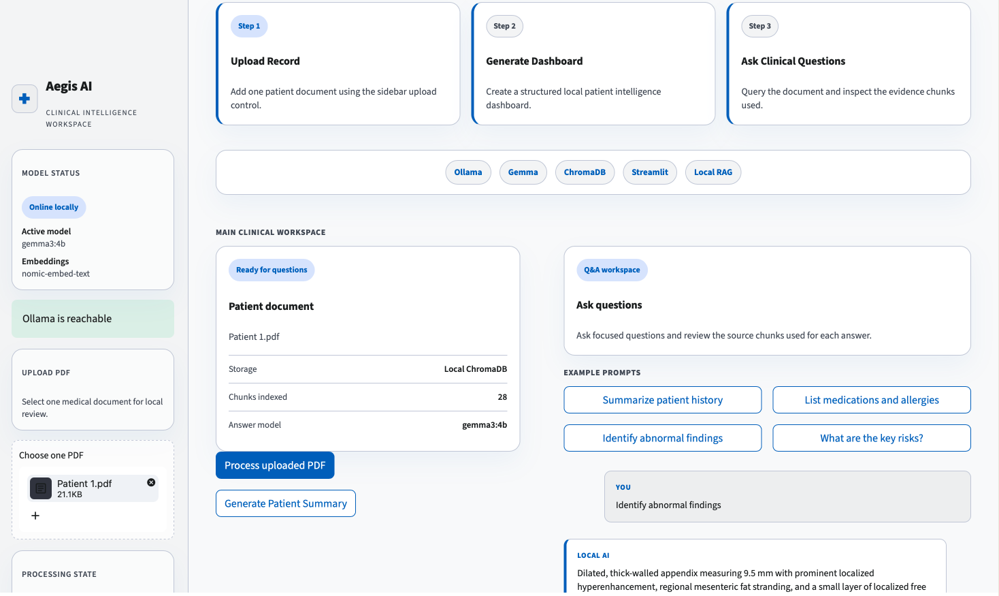
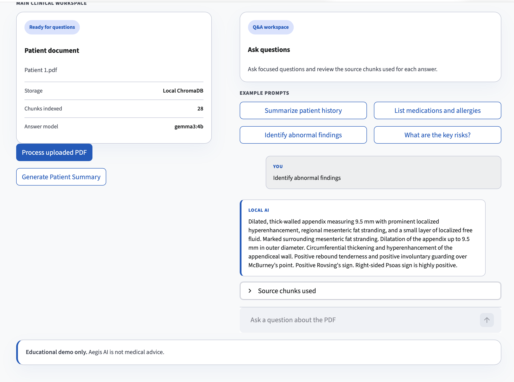

# Aegis AI

Enterprise-grade private healthcare AI for local medical document review.

Aegis AI is an offline-first Streamlit application that lets a user upload one medical PDF, generate a structured patient intelligence dashboard, and ask source-grounded questions using only local AI infrastructure.

## Problem Statement

Healthcare documents often contain important details spread across medications, allergies, labs, visits, imaging, and narrative notes. Reviewing them manually is slow, and sending sensitive records to cloud AI services can create privacy and compliance concerns.

Aegis AI explores how local retrieval-augmented generation can support private clinical document review while keeping source evidence visible to the user.

## What The App Does

- Uploads a single medical PDF.
- Extracts text locally with PyMuPDF.
- Splits document text into retrieval-friendly chunks.
- Generates embeddings locally with Ollama and `nomic-embed-text`.
- Stores vectors locally in ChromaDB.
- Uses Ollama with `gemma3:4b` to answer questions from retrieved context.
- Generates a structured patient intelligence dashboard.
- Shows source chunks used for each answer.

## Key Features

- **Offline-first workflow:** no cloud model API is required.
- **Private document review:** records stay on the local machine.
- **Patient intelligence dashboard:** extracts overview, conditions, medications, allergies, abnormal labs, recent visit details, imaging findings, and risk flags.
- **Source-grounded Q&A:** every answer is based on retrieved chunks from the uploaded PDF.
- **Clinical SaaS UI:** polished Streamlit interface designed for a healthcare AI portfolio demo.
- **Simple architecture:** beginner-friendly Python app with clear local components.

## Tech Stack

- Python
- Streamlit
- PyMuPDF
- Ollama
- `nomic-embed-text`
- `gemma3:4b`
- ChromaDB

## Architecture Flow



## How To Run Locally

1. Create and activate a virtual environment:

```bash
python3 -m venv venv
source venv/bin/activate
```

2. Install Python dependencies:

```bash
pip install -r requirements.txt
```

3. Install and start Ollama:

```bash
ollama serve
```

4. Pull the local models:

```bash
ollama pull nomic-embed-text
ollama pull gemma3:4b
```

5. Run the app:

```bash
streamlit run app.py
```

Or use:

```bash
./run_demo.sh
```

## Demo Questions

- Summarize patient history
- List medications and allergies
- Identify abnormal findings
- What are the key risks?
- List every medication exactly as written in the document

## Offline And Privacy Note

Aegis AI is designed to run locally with Ollama and ChromaDB. PDF parsing, embeddings, vector storage, retrieval, dashboard generation, and Q&A are handled on the local machine. The app does not require external model API calls.

## Educational Disclaimer

This project is for educational and demonstration purposes only. It does not provide medical advice, diagnosis, or treatment recommendations. Clinical decisions should always be made by qualified healthcare professionals.

## Screenshots

### Landing Page


### Patient Intelligence Dashboard


### Source-Grounded Q&A


## Demo Video

- [Aegis AI Demo Part 1](https://www.loom.com/share/4095acc3b1f546f0a096c71aa6eab50b)
- [Aegis AI Demo Part 2](https://www.loom.com/share/78643d84e42b4ecdbeaafdb1b9a6a22e)

## Project Files

- `app.py` - Streamlit application with local PDF RAG and structured dashboard.
- `requirements.txt` - Python dependencies.
- `README.md` - Setup, architecture, and demo overview.
- `DEMO_SCRIPT.md` - 2-3 minute portfolio walkthrough script.
- `PROJECT_SUMMARY.md` - Portfolio summary and design rationale.
- `run_demo.sh` - Convenience script to launch the app.
